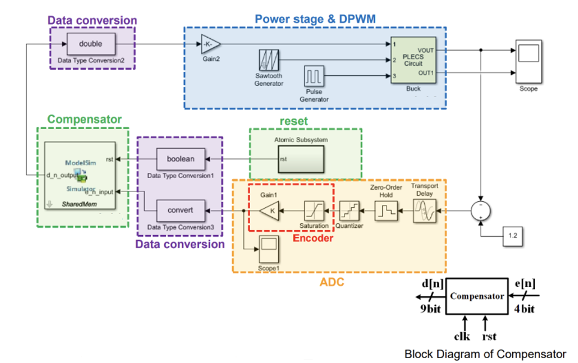

# ADC encoder

## introduction
1. Add a sample_clk and an ADC encoder which is available in actual ADC implementation
2. Use AD7822 as ADC
  - 8-bit half-flash ADC with a 420 ns conversion time
  - Supply voltage ranges: 3V ± 10% and 5V ± 10%
  - Input voltage ranges: 0V to 2𝑉𝑝−𝑝, 𝑉𝐷𝐷 = 3V ± 10%, 0V to 2.5𝑉𝑝−𝑝, 𝑉𝐷𝐷 = 5V ± 10%
  - Need to output encoded outputs from the ADC
3. Digiatl buck converter closed-loop simulation
  - transient
  - steady-state

## System Specification
| Parameter                             | Symbol  | Value               |
|---------------------------------------|---------|---------------------|
| Input Voltage                         | Vg    | 6V                  |
| Output Voltage                        | Vo    | 1V                  |
| Switching Frequency                   | fs    | 500kHz              |
| Output Current                        | Io    | 500mA–1A            |
| Steady-State Output Voltage Ripple    | ΔVOSS | < 2%                |
| Steady-State Inductor Current Ripple  | ΔiLSS | < 0.3A (30% of Io_max) |
| Overshoot                             | OS%     | < 10%               |
| Inductance                            | L       | 10μH                |
| Inductor Equivalent Series Resistance | RL    | 68mΩ                |
| Capacitance                           | C       | 22μF                |
| Capacitor Equivalent Series Resistance| RC    | 20mΩ                |
| Phase Margin                          |                  | >65 degrees         |
