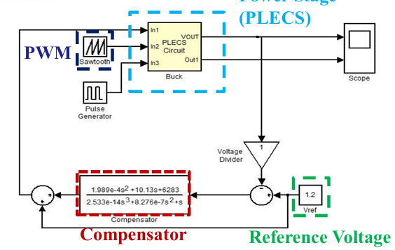
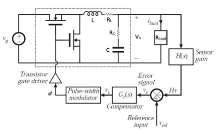

# Analog Voltage Mode Buck DC-DC Converter

## Introduction
1. Design analog voltage mode buck converter with Matlab SISOTool.
   - Matlab SISOTool: Compensator design considering frequency response.
   
2. Simulate the closed-loop system with PLECS and Matlab Simulink.
   - PLECS: Buck power stage model.
   - Matlab Simulink: Controller behavior model
   
   

## Specicicaton
| Parameter                             | Symbol  | Value               |
|---------------------------------------|---------|---------------------|
| Input Voltage                         | Vg    | 6V                  |
| Output Voltage                        | Vo    | 1V                  |
| Switching Frequency                   | fs    | 500kHz              |
| Output Current                        | Io    | 500mA–1A            |
| Steady-State Output Voltage Ripple    | ΔVOSS | < 2%                |
| Steady-State Inductor Current Ripple  | ΔiLSS | < 0.3A (30% of Io_max) |
| Overshoot                             | OS%     | < 10%               |
| Inductance                            | L       | 10μH                |
| Inductor Equivalent Series Resistance | RL    | 68mΩ                |
| Capacitance                           | C       | 22μF                |
| Capacitor Equivalent Series Resistance| RC    | 20mΩ                |

## Design flow
1. Use the Buck converter control-to-output transfer function and design the compensator using SISOTool. Verify that the Buck converter has sufficient stability margin in the frequency domain.

2. Build the Buck converter power stage and PWM in Simulink using PLECS, and verify whether the steady-state operation complies with system specifications.

3. Use Matlab/Simulink simulations to verify that the Buck converter with the designed compensator operates correctly under both steady-state and transient conditions.

● Ensure that after compensation, the system can meet the specifications across all input and load conditions, as well as in both time and frequency domains.
