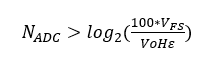
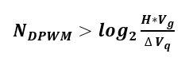
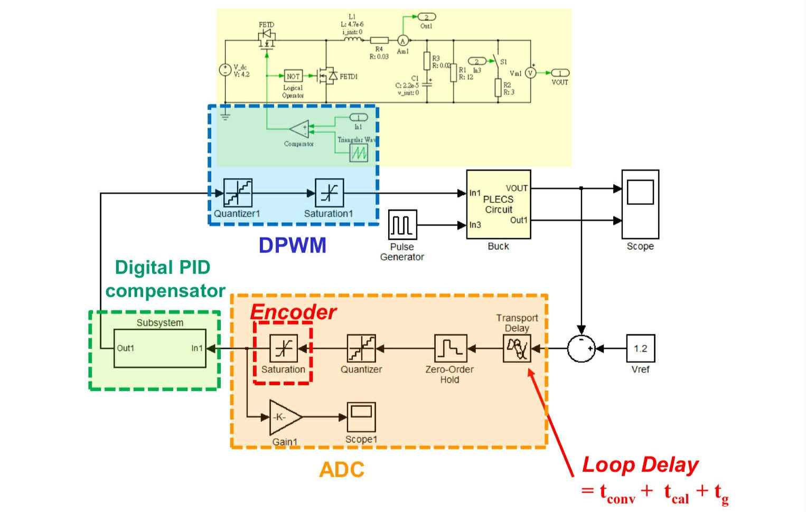

# Digitally Controlled Voltage Mode Buck Converter

## Introduction

1. Design an digital voltage mode buck converter
   - ADC, DPWM selection
2. Design an digital compensator with Matlab SISOTool
   - Design by Emulation (DBE) Flow
3. Construct Simulink behavior model of digital buck converter with PLECS and Matlab Simulink
4. Evaluate LCO
   - Static situation (A1, A2)
   - Dynamic situation (B1, B2

## System Specification
| Parameter                             | Symbol  | Value               |
|---------------------------------------|---------|---------------------|
| Input Voltage                         | Vg    | 6V                  |
| Output Voltage                        | Vo    | 1V                  |
| Switching Frequency                   | fs    | 500kHz              |
| Output Current                        | Io    | 500mA–1A            |
| Steady-State Output Voltage Ripple    | ΔVOSS | < 2%                |
| Steady-State Inductor Current Ripple  | ΔiLSS | < 0.3A (30% of Io_max) |
| Overshoot                             | OS%     | < 10%               |
| Inductance                            | L       | 10μH                |
| Inductor Equivalent Series Resistance | RL    | 68mΩ                |
| Capacitance                           | C       | 22μF                |
| Capacitor Equivalent Series Resistance| RC    | 20mΩ                |
| Phase Margin                          |                  | >65 degrees         |

ADC: The conversion range of ADC:  

DPWM: A necessary condition to avoid the limit cycle oscillation (A1):

## Design process
Consideration of Delay Time
   - The total delay time is Td = Tconv + Tcal + D*Ts + Tg
   - Tconv = 420ns
   - Tcal = propagation delay (10ns)
   - Tg = 55ns + 10ns
   - D*Ts = duty cycle

### Design by Emulation
1. import the transfer function of buck conbveter with delay to SISOTOOL
2. Place the poles and zeros of the compensator on s-domain bode plot
3. Optimize the compensator gain by root locus
4. S-to-Z conversion
5. Co-simulation with ADC and DPWM

## LCO evaluation
 - Static situation
    - A1: DC solution exists to the system
    - A2: Compensator must include an integral action with a limited integral gain
 - Dynamic situation
    - B1: Compensator must result in sufficiently large gain margin of the linear part
    - B2: Gain margin of the close loop system is at least 1.6

