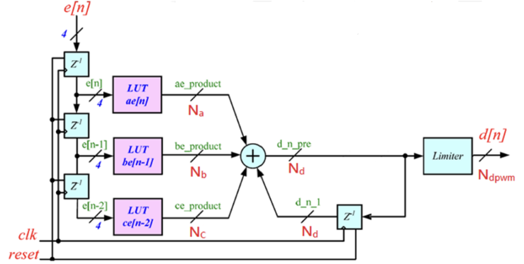

# Digitally PID Compensator Implement

## introduction
1. Z-domain compensator quantization
2. Coding with Verilog-HDL for digital compensator
3. Co-Simulation with Matlab/Modelsim

## System Specification
| Parameter                             | Symbol  | Value               |
|---------------------------------------|---------|---------------------|
| Input Voltage                         | Vg    | 6V                  |
| Output Voltage                        | Vo    | 1V                  |
| Switching Frequency                   | fs    | 500kHz              |
| Output Current                        | Io    | 500mA–1A            |
| Steady-State Output Voltage Ripple    | ΔVOSS | < 2%                |
| Steady-State Inductor Current Ripple  | ΔiLSS | < 0.3A (30% of Io_max) |
| Overshoot                             | OS%     | < 10%               |
| Inductance                            | L       | 10μH                |
| Inductor Equivalent Series Resistance | RL    | 68mΩ                |
| Capacitance                           | C       | 22μF                |
| Capacitor Equivalent Series Resistance| RC    | 20mΩ                |
| Phase Margin                          |                  | >65 degrees         |

## Implementation process

1. Compensator hardware implementation
    - The Compensator is realized in direct-from.
    - The multipliers will be replaced by LUTs.
    - To reduce LUT's area the dominator will assign as z(z-1)
    - transform parameter to binary code
2. Choose Z-domain Compensator word-length
    - the accuracy enough coefficients should be first
    - Integer parts of the LUT: N = int[log2(1+2|k*e[n]max|)]
    - fractional parts of the LUT: N = int[log2(1/(a+b+c))]
    - N(total) = N1 + Nf +1
    - word-length = max([Na, Nb, Nc])
3. Quantization
    - Build a binary LUT, convert the compensator coefficients into binary form
    - Multiply the coefficients with the input results to determine the number of bits and the internal value of LUT
4. Build the Verilog-HDL code for digital compensator
    - Modulate the integer number to be consistent with the LUT results
    - Fill in the results in the Look-up-table
    - Truncation

5. Build Matlab Model with Modelsim
6. Co-Simulation with Matlab/Modelsim
     - Buck converter closed-loop simulation (including power stage, PWM, compensator)
