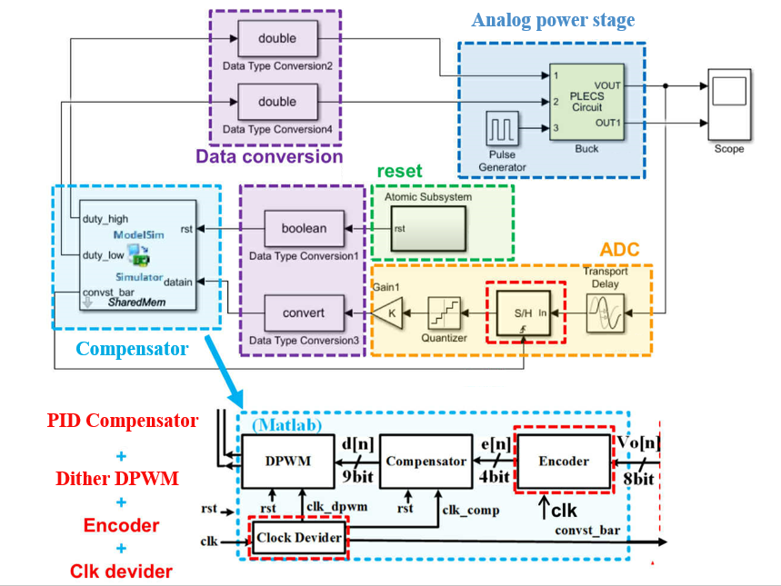
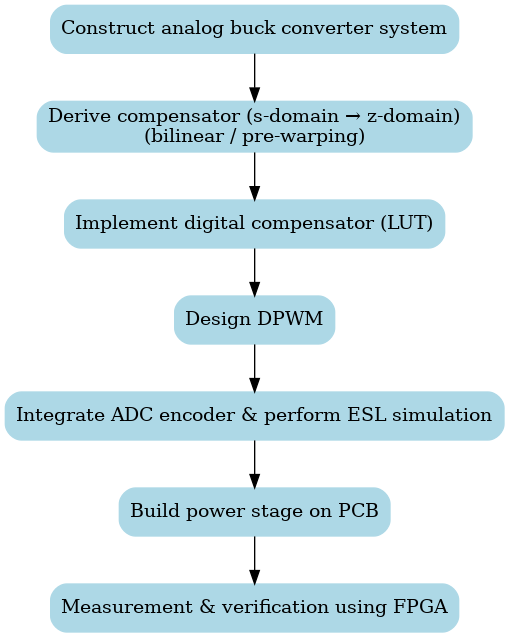

# Digitally-Controlled-DC-DC-Buck-Converter

## Introduction
In recent years, digital power control has experienced rapid growth, and the demand for talent in this field from related industries has been steadily increasing. Digital power control encompasses multiple domains, including VLSI/CAD, power electronics, digital control, and digital signal processing. However, there is still no dedicated textbook available as a reference, and both teaching and research in this area remain challenging due to the high entry barrier.

In this work, I applied digital power control techniques to the digitalization of traditional analog power control circuits. Through a series of simulation experiments and practical implementations, I learned how to design circuits according to system specifications and convert analog controllers into digital form. Finally, the design was programmed into an FPGA to achieve hardware realization, and instruments were used to perform system-level measurements and verification.

## System Specification
All components are designed according to the specifications below, using MATLAB Simulink and PLECS to tune the internal system parameters.
| Parameter                             | Symbol  | Value               |
|---------------------------------------|---------|---------------------|
| Input Voltage                         | Vg    | 6V                  |
| Output Voltage                        | Vo    | 1V                  |
| Switching Frequency                   | fs    | 500kHz              |
| Output Current Range                  | Io    | 500mA–1A            |
| Steady-State Output Voltage Ripple    | ΔVOSS | < 2%                |
| Steady-State Inductor Current Ripple  | ΔiLSS | < 0.3A (30% of Io_max) |
| Overshoot                             | OS%     | < 10%               |
| Inductance                            | L       | 10μH                |
| Inductor Equivalent Series Resistance | RL    | 68mΩ                |
| Capacitance                           | C       | 22μF                |
| Capacitor Equivalent Series Resistance| RC    | 20mΩ                |
| Phase Margin                          |                  | >65 degrees         |
| Inductor/ESR                          |                  | 10μH/30mΩ   |
| Capacitor/ESR                         |                  | 22μF/20mΩ   |
| System Clock                          |                  | 32MHz       |
| DPWM Resolution                       |                  | 8.2mV       |
| ADC Resolution                        |                  | 30mV        |
| ADC Sampling Frequency                |                  | 500kHz      |

## Design flow

1. Construct an Analog buck converter system
    - The design of the Buck DC-DC converter began with both open-loop and closed-loop implementations, where feedback control was introduced to improve transient response and output stability. By carefully placing poles and zeros in the analog compensator, stability criteria were satisfied with a phase margin exceeding 65° and a damping ratio above 0.7, ensuring fast settling and minimal oscillations.
2. Derive the compensator from the s-domain to the z-domain using bilinear transformation with pre-warping
    - Methodology: The compensator was transformed from the s-domain to the z-domain through a design-by-emulation strategy, facilitating effective digital implementation.
3. Implement the digital compensator using a look-up table (LUT)
    - Quantization: The compensator in the z-domain was discretized and mapped into a look-up table (LUT) using MATLAB, preserving numerical accuracy for hardware implementation.
    - Hardware Realization: The digital compensator was then implemented in Verilog HDL, enabling seamless integration into the FPGA-based hardware system.
4. Design the DPWM (Digital Pulse Width Modulator)
    - Modules: Multiple DPWM configurations—including Counter, Hybrid, Dither, and Dither with dead-time—were designed, simulated, and evaluated for performance comparison.
5. Integrate the ADC encoder and perform ESL (Electronic System-Level) simulation
    - Design Considerations: Core modules—including transport delay, zero-order hold, quantizer, and saturation—were incorporated to improve ADC accuracy and reliability.
    - Integration: The ADC encoder was seamlessly integrated with the digital compensator, DPWM, and power stage, forming a closed-loop system.
6. Build the power stage on PCB, Conduct measurement and verification using FPGA implementation
    - Simulation: A complete closed-loop system was simulated, integrating all previously designed modules. The simulation results confirmed system stability and compliance with performance requirements.
    - Hardware Implementation: The digital controller was implemented on an FPGA using Quartus, while the external power stage was realized on a PCB to enable real-world hardware testing.

## Tools
- Verilog HDL: Facilitated the design and simulation of digital circuit modules.
- PLECS: Used for circuit architecture and dynamic behavior simulations.
- Matlab/Simulink: Utilized for system modeling and data analysis.
- SISOTool: Applied for compensator design and stability analysis in control systems.
- Quartus: Used for FPGA implementation.

